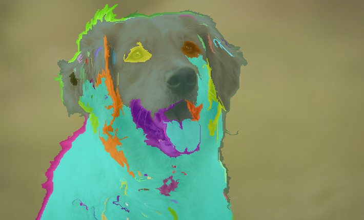
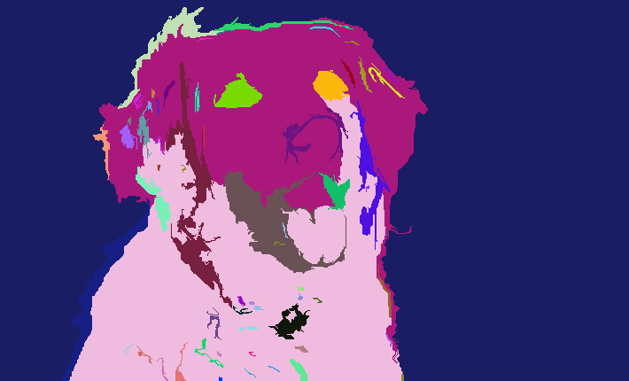
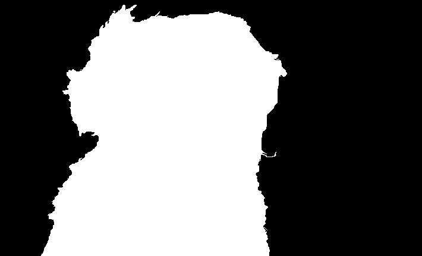

# Image Segmentation

This project implements the Felzenszwalb–Huttenlocher (FH) graph-based image segmentation algorithm.
Pixels are treated as nodes in a graph, with edges weighted by intensity differences.
Components are merged according to internal variation and inter-component difference, producing perceptually consistent regions without requiring the number of segments in advance.

After segmentation, the background is identified as the component containing the largest number of pixels touching the image border.
The background mask is then expanded using a BFS region growing procedure across adjacent segments, and only the remaining regions that cannot be reached from the border are classified as foreground.

  
  

  
  

