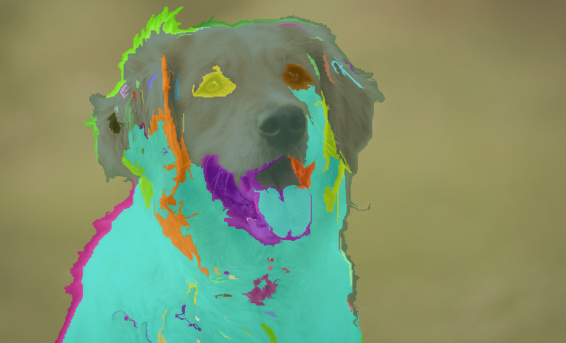
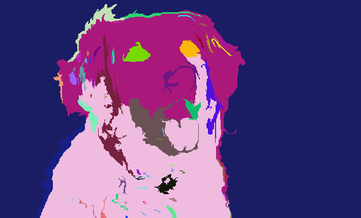
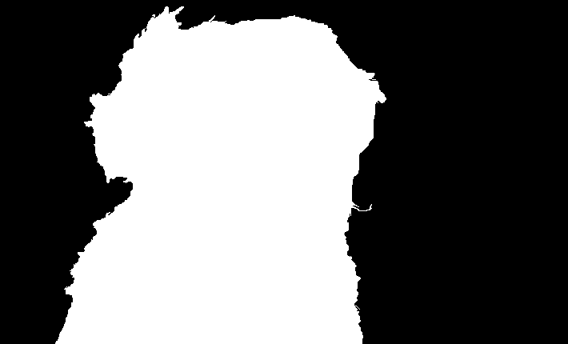

# Image Segmentation

This project implements the Felzenszwalb–Huttenlocher (FH) graph-based image segmentation algorithm. Pixels are treated as nodes in a graph, with edges weighted by intensity differences. Components are merged according to internal variation and inter-component difference, producing perceptually consistent regions without requiring the number of segments in advance.

After segmentation, the background is identified as the component containing the largest number of pixels touching the image border. The background mask is then expanded using a BFS region growing procedure across adjacent segments, and only the remaining regions that cannot be reached from the border are classified as foreground.

<p align="center">
  
  
</p>

<p align="center">
  
  
</p>

## Usage

Compile and run:

```bash
make run
```

The program processes all images from `images/` and saves results in `results/`.

Supported formats:
- `.png`
- `.jpg`
- `.jpeg`
- `.bmp`

## Parameters

You can adjust parameters in `main.cpp`:

```cpp
const vector<float> K_VALUES = {30000, 100000, 200000};
const vector<int> TOL_VALUES = {500, 900, 1200};
```

- `k` controls segmentation granularity (smaller = more/smaller segments, larger = fewer/larger segments)
- `tol` controls how aggressively neighboring regions are classified as background

## Output files

For each image and each (`k`, `tol`) pair, one folder is created:

```text
results/<image_name>_k<k>_tol<tol>/
```

Each folder contains:
- `random.png` - random color visualization of segments
- `blend.png` - blend of original image and segmentation
- `mask.png` - binary foreground/background mask
- `foreground.png` - original image with background painted black

## Folder structure

```text
Graph-Image-Segmentation/
├── images/                  # input images
├── include/                 # headers
├── source/                  # implementation files
├── results/                 # generated outputs
│   ├── example1_k30000_tol500/
│   │   ├── random.png
│   │   ├── blend.png
│   │   ├── mask.png
│   │   └── foreground.png
│   └── ...
├── main.cpp                 # main processing loop
├── makefile
└── seminarski.tex
```

## Clean generated outputs

```bash
make clean
```
